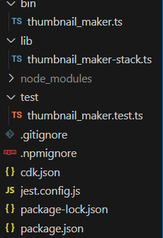

# Serverless Image Thumbnail Generator on AWS

This project demonstrates a fully serverless, event-driven architecture on AWS for automatically generating image thumbnails. When an image is uploaded to a designated S3 bucket, an AWS Lambda function is triggered to create a resized thumbnail and store it in a separate S3 bucket.

The entire infrastructure is defined and deployed as code using the AWS Cloud Development Kit (CDK) with TypeScript. The image processing logic is written in Python.

## Architecture

The workflow is simple and robust:

1. A user or application uploads an image file to the IngressBucket.

2. The S3 OBJECT_CREATED event triggers an S3 Event Notification.

3. The notification invokes the Python-based AWS Lambda function.

4. The Lambda function downloads the image, resizes it using the Pillow library, and uploads the resulting thumbnail to the EgressBucket.

```[Upload Image] ---> [S3 IngressBucket] ---> [S3 Event Trigger] ---> [AWS Lambda Function] ---> [S3 EgressBucket]```

## Core Technologies Used

Framework: AWS CDK (TypeScript)

Languages: TypeScript (Infrastructure), Python 3.11 (Lambda Logic)

AWS Services:

- Amazon S3: For object storage.

- AWS Lambda: For serverless compute.

- AWS IAM: For managing permissions.

- Amazon CloudWatch: For logging and monitoring. (This was very helpful when debugging my lambda function)

Setup and Deployment

## Prerequisites

An AWS Account - Obviously

AWS CLI configured

Node.js and npm

Docker Desktop + WSL Intergration setting enabled (must be running for CDK asset bundling)

### Deployment Steps
`Side Note:`

Getting distracted here but lets talk about what happens when you init a new app.. (Mainly so I can reinforce my memory)



OK so when you run the command in step 4 you'll get this mess, let break it down quick:

Core App Code

`lib/thumbnail_marker-stack.ts:` This is the most important file. Its where I spent most of my time writing the code that defines the AWS resources (like S3 buckets and Lambda functions). It's like the blueprint for your infra stack.

`bin/thumbnail_maker.ts:` I think this is like the main entry point for the CDK application. It's job is to load and create an instance of the stack we defined in the `lib` folder. I didn't do anything in this file.

Project and Dependency Management

`package.json:` This is the manifest for your project. It lists your project's name, version, and—most importantly—the CDK libraries and other packages it depends on.

`package-lock.json:` An automatically generated file that records the exact version of every package your project uses. This ensures that you get the same results every time you install your dependencies.

`node_modules/:` This folder contains the actual code for all the dependencies listed in your package.json. It's created when you run npm install, can be quite large, and should not be committed to git. What's nice is when you init the app its nice enough to update the .gitignore file with all the files that don't need to be commited - woo.

No idea what the other files are doing but as start new (harder) projects I'm sure I'll find out.

#### Actual Deployment Steps
1. Clone the repository.

2. Install the Node.js + dependencies:
```bash
$ tar -xvf node.js.tar -C /opt/nodejs/ --strip-components=1 # Make sure to update .bashrc as well (lazy I know)
$ npm install
$ npm install -g typescript
$ npm install -g aws-cdk
```
3. *If first time running on aws account*: Bootstrap Your Environment
```bash
$ cdk bootstrap aws://YOUR_ACCOUNT_NUMBER/YOUR_REGION
```
4. If making a new app (Optional):
```bash
$ cdk init app --language typescript
```
5. Deploy this app:
```bash
$ cdk deploy
```

## Development Journey & Troubleshooting

This project served as a practical learning experience. Several common and "advanced" issues were encountered and resolved during development. (Was cooked for a bit)

| Problem | Error Message / Symptom | Solution |
| :--- | :--- | :--- |
| **Initial CDK Error** | `ValidationError: ...no Stack found` | The S3 bucket constructs were missing the `this` scope. Corrected the syntax to `new s3.Bucket(this, 'ID', ...)`. |
| **CDK Naming Conflict** | `Error: There is already a Construct with name ...` | The logical IDs for resources must be unique within a stack. Renamed conflicting logical IDs to be unique. |
| **S3 Creation Failure** | `CREATE_FAILED ... already exists` | Hardcoded S3 bucket names must be globally unique (duh). Removed the `bucketName` property and allowed the CDK to auto-generate unique names/just used very static names with my lastname. |
| **Lambda Dependency Failure** | `Runtime.ImportModuleError: No module named 'PIL'` | A multi-step fix was required:<br>1. Added `Pillow` to `requirements.txt`.<br>2. Removed invalid built-in modules (`os`, `io`) from `requirements.txt`.<br>3. Switched to the `@aws-cdk/aws-lambda-python-alpha` construct for more robust dependency bundling. |
| **Docker Environment Issue**| `docker: command not found` or `permission denied` | The CDK was running in a WSL 2 environment not connected to Docker Desktop. Fixed by enabling WSL Integration in Docker settings and adding the user to the `docker` group (`sudo usermod -aG docker $USER`). Also made sure to restart WSL for docker and my Alma node. |
| **Lambda Signature Error**| `TypeError: lambda_handler() takes 1 positional argument but 2 were given` | The Lambda handler signature was missing the required `context` parameter. Corrected the function definition to `def lambda_handler(event, context):`. |
| **S3 Object Not Found** | `NoSuchKey: The specified key does not exist.` | Caused by an S3 eventual consistency race condition. Implemented a simple retry loop with a short delay in the `get_object` call. |

## Thoughts
Overall, I think this was a good into to using CDK to deploy cloud infrastruce and I can def see the use case over CFTs (biased bc I'm sick of yaml), excited to work with this more in the future.